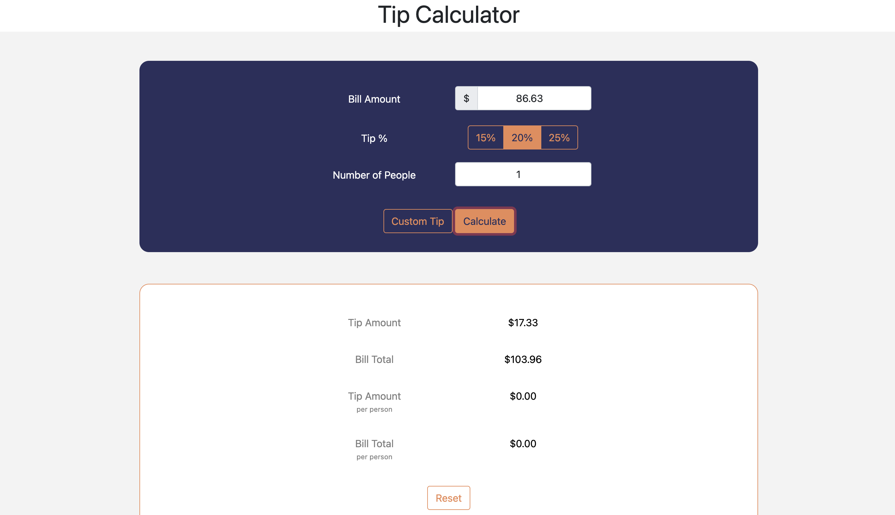
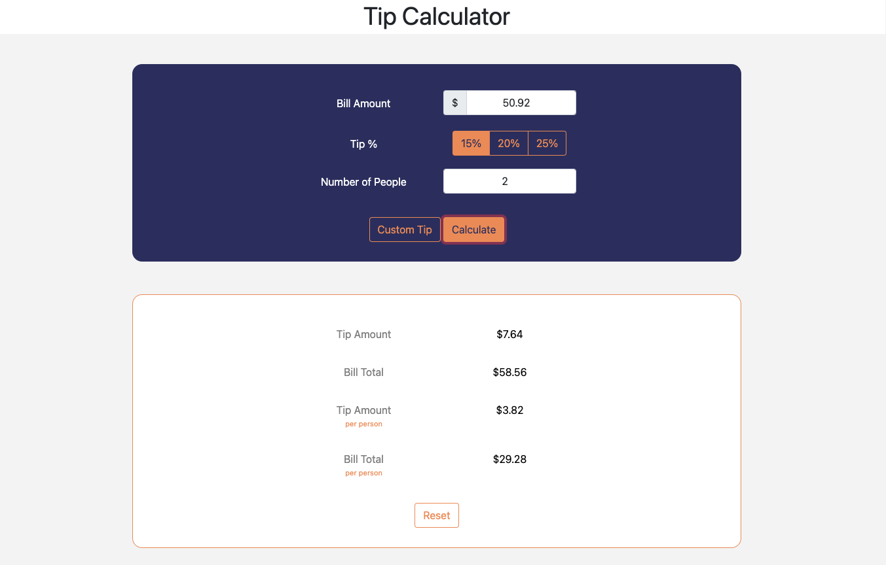
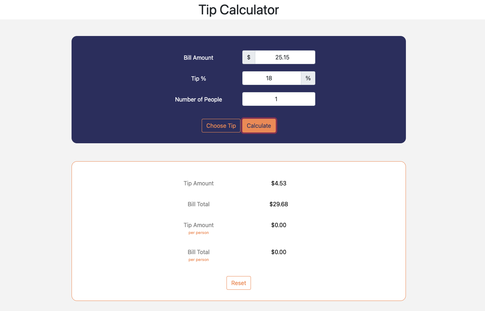
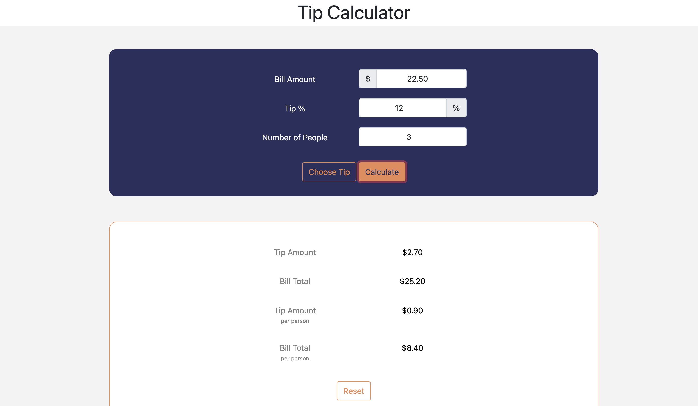
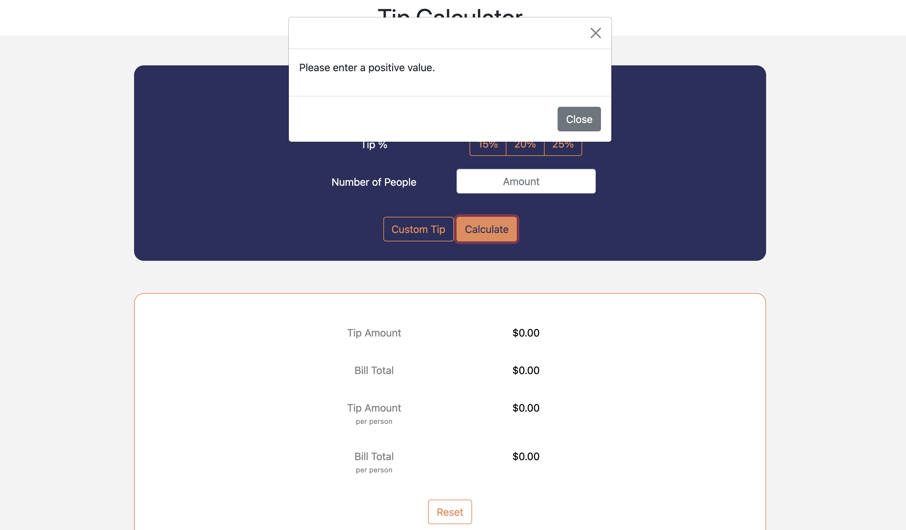
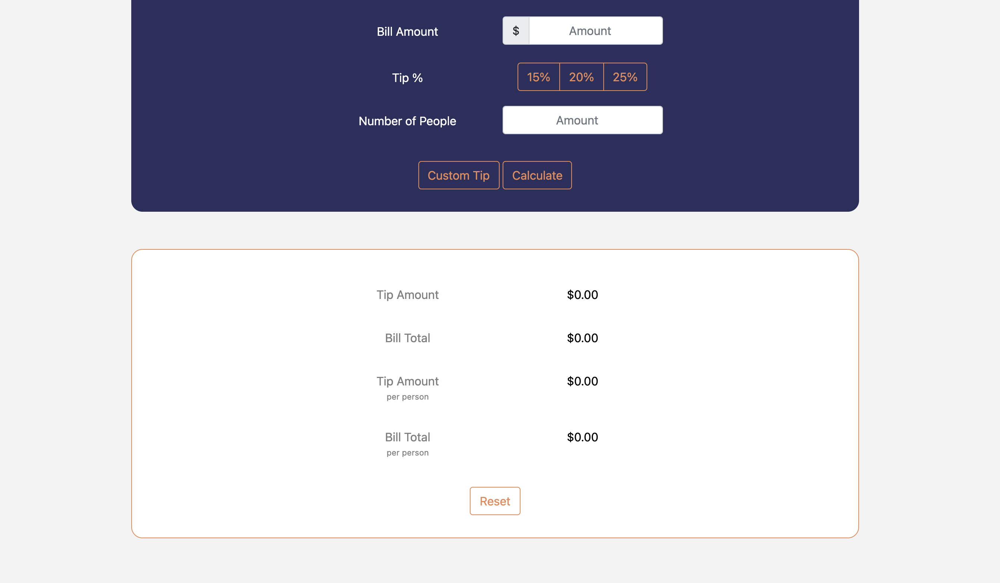

# Tip-Calculator

https://alexandra-hionis.github.io/Tip-Calculator/

## Description

Let's say you had a great dinner and want to calculate the tip quickly and efficiently. The user can enter the bill amount and select average, most commonly used tip percentages 15%, 20%, and 25%. User can also enter a custom tip if they decide to. Results will show the bill total and the tip amount.

## Table of Contents

- [Description](#description)
- [Usage](#usage)
- [License](#license)
- [Tests](#tests)
- [Questions](#questions)

## Usage

A simple application where all the user needs to do is enter inputs or press a button and their tip and bill total are magically displayed.

## License

ISC, MIT

## Tests

No tests were used

## Questions

GitHub: https://github.com/Alexandra-Hionis  
Email: Alexandra.hionis@gmail.com  
